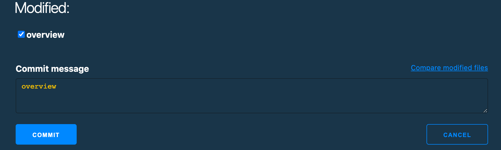
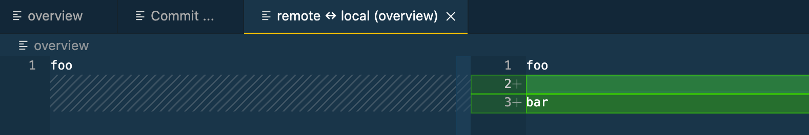
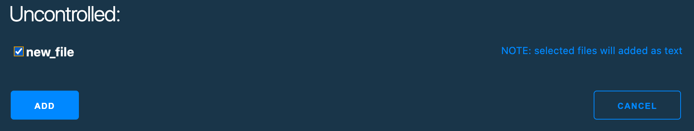
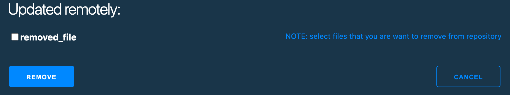

<h1 align="center">
Visual Studio Code extension for CVS support
</h1>

This is the Visual Studio Code extension to use CVS.

**This extension is in very early stage of development. Use on your own risk**

## Setting up

After installing the extension, add the `CodeCVS.CVSROOT` setting to your settings.json:

`"CodeCVS.CVSROOT": ":pserver:cvs@foo.bar.com:/var/cvsroot"`

## Extension Settings

`CodeCVS` extension contributes the following settings:

* `CodeCVS.CVSROOT`: [CVSROOT](https://wiki.gentoo.org/wiki/CVS/Tutorial#The_CVSROOT) variable
* `CodeCVS.add_as_binary`: Add uncontrolled files as binary to the repository

## Features

## CodeCVS: commit ...

The command allows you to commit local changes to the repository.

Modify any commited to the repository file, then call `CodeCVS: commit ...` command:

Click button `Compare modified files` to see diff's:

## CodeCVS: add ...

The command allows you to add locally added files to the repository.

Create file in your local repository, then call `CodeCVS: add ...` command:

If you want to add file as binary, add the `CodeCVS.add_as_binary` setting to your settings.json:

`"CodeCVS.add_as_binary": 1`

## CodeCVS: remove ...

The command allows you to remove locally removed files from repository.

Delete file from your local repository, then call `CodeCVS: remove ...` command:

Select only the files that you deleted.

## CodeCVS: add

The command allows you to add locally added directory to the repository.

## CodeCVS: compare

The command allows you to compare file with clean copy of it from repository.

## CodeCVS: changes

The command allows you to see local changes compared to the repository.

## CodeCVS: checkout

The command allows you to checkout module from repository.

## CodeCVS: update

The command allows you to update local files/directories from the repository.

## Output

`CodeCVS` extension duplicates stderr of the CLI CVS client to the OUTPUT tab. To see CVS errors, select `CodeCVS` from the contextual menu.

## Requirements

* CLI CVS client ([Windows](https://ftp.gnu.org/non-gnu/cvs/binary/stable/x86-woe/), [MacOS](https://formulae.brew.sh/formula/cvs)) should be accessible in the PATH
* Visual Studio Code v1.51.0

